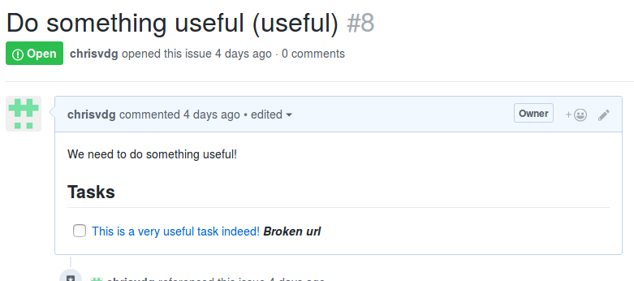
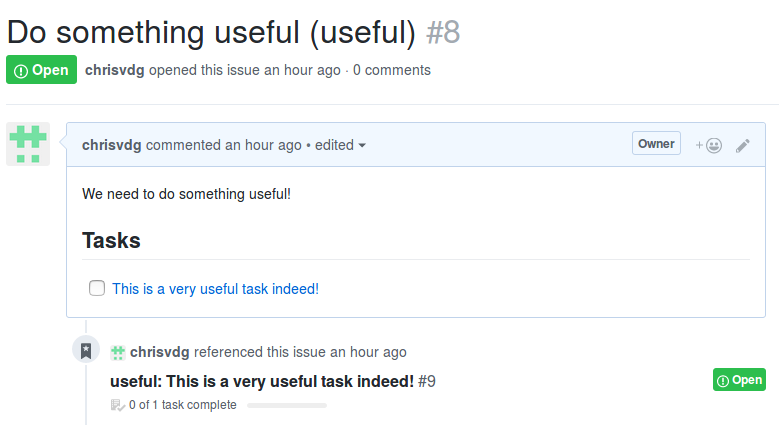
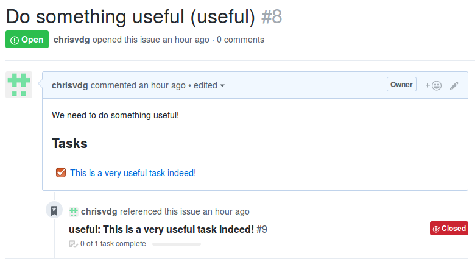
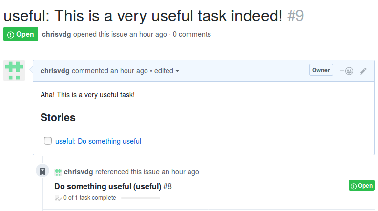
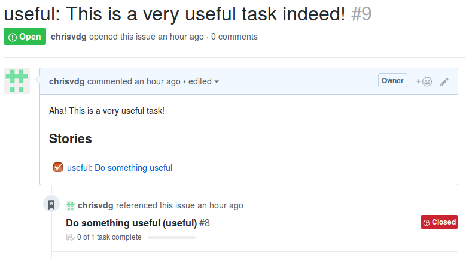

# StoryBot

StoryBot is a tool that can link story issues to task issues.

The StoryBot can be provided with Github as well as Gitea repos in which the bot will loop trough the issues and check for story and task issues and link them together.

The way the bot detects stories and tasks is trough the formatting of the titles of the issues inside the repos.

## Usage

This chapter explains the full setup for StoryBot.  
There is a also an example script available [here](../../JumpScale9Lib/tools/storybot/example.py) if you want to start straight away.

### Step 1: Get API keys

The bot needs access to the repos provided to the bot, so it can read and edit them.  
For this the bot requires an API token for authentication from the corresponding git service (Github, Gitea).

For Github an API key can be created here: https://github.com/settings/tokens

Either click on `Generate new token` or use a token previously created.

### Step 2: Setup Repositories

List the repositories the bot should use.  
The list of repos provided to the StoryBot is a comma separated list that should have the following format:

`<owner_username>/<repository_name>`

Or:

`<repository_name>`

The StoryBot will then look at the API token owner's account for these repositories.

Or:

`<owner_username>/*`

The StoryBot will then use all the repositories from the user at the time it needs it.

Then make sure the issues of those repo are properly formatted for the StoryBot.  
For story issues formatting, checkout the [Story formatting](#Story-formatting) chapter.  
For task issues formatting, checkout the [Task formatting](#Task-formatting) chapter.

### Step 3: Setup StoryBot

Enter the Jumpscale interpreter from the terminal

```sh
js9
```

Or import Jumpscale in your python script

```py
from js9 import j
```

Prepare the data for StoryBot

```py
data = {
    "gitea_base_url": "https://docs.greenitglobe.com",        # base url for gitea (used for creating issue urls)
    "gitea_api_url": "https://docs.greenitglobe.com/api/v1",  # base url for the Gitea API
    "gitea_token_": "<your Gitea api token>",                 # Gitea api access token
    "gitea_repos": "hello_world, gig/org_development",        # list of repos on Gitea the StoryBot needs to check
    "github_token_" : "<your Github api token>",              # Github api access token
    "github_repos": "test, some_user/some_repo, zero-os/*",   # list of repos on Github the StoryBot needs to check
}
```

If only Github or Gitea should be used, leave the fields of the unused git provider empty.

Create the client:
```py
bot = j.tools.storybot.get(data=data, interactive=False)
```

If the Jumpscale config manager should be used, omit the `data` and `interactive` variable and the config manager will interactively ask for the required configuration variables.

### Step 4: Run StoryBot

To link the tasks and stories together, call the `link_stories` method of the bot:

```py
bot.link_stories()
```

This will run the bot a single time to go through all the provided repos to fetch all the stories and link found tasks in those repos.

At the end of a successful run, the story and task issues should contain lists that link stories to tasks and tasks to stories.  
The resulting list in stories are described in the [Generated task list in stories](#Generated-task-list-in-stories) chapter.  
The resulting list in tasks are described in the [Generated story list in tasks](#Generated-story-list-in-tasks) chapter.

#### Run at intervals

To link the tasks and stories together at an interval, call the `link_stories_interval` method of the bot:

```py
bot.link_stories_interval(interval=30)
```

This will link stories and tasks from the repos and then wait the provided `interval` period in minutes (default is 60 minutes).

Press ctrl+c to stop.

#### URL checking

The `link_stories` method has the `check_broken_urls` parameter, which when `True` will loop over all tasks and stories after they have been linked and check their lists to see if the urls in those lists are still working or not.

```py
bot.link_stories(check_broken_urls=True)
```

If links turn out to be broken, the list item will be appended with: `***Broken url***`  
Which on Github results into:



## Story formatting

Stories are detected by their label and the format of their title. 

Story issues should have the label `type_story`.  
And the titles of the story issues should be formatted in the following way:

`$STORY_DESCRIPTION ($STORY_NAME)`

Story issues are therefor detected by the last part of the title wrapped by parentheses, containing the story's title/name.  
The first part will be seen as the story's description.

e.g.:

`Do something useful (useful)`

## Task formatting

Titles of task issues should be formatted in the following way:

`$STORY_NAME: $TASK_SHORT_DESCRIPTION`

Task issues are detected by having a colon `:` in the title containing a story title/name before the colon and the short description/title of the task, bug report, feature request after it.  
Only issues that have an existing story name will be detected as tasks.

e.g.:

`useful: This is a very useful task indeed!`

Tasks also support being part of multiple stories, if this is the case, separate the story names with a comma `,`.  
Therefor avoid using commas in story names.

e.g.:

`useful, even_more_useful: This is a very useful task indeed!`

## Generated task list in stories

Task lists generated by the bot inside stories will look something like the following

```md
## Tasks

- [ ] [This is a very useful task indeed!](https://github.com/some_user/some_repo/issues/2)
```

On Github, it would look something like:



When the task would be closed an the bot would run again, the generated list will look like:

```md
## Tasks

- [x] [This is a very useful task indeed!](https://github.com/some_user/some_repo/issues/2)
```

And would look like this on Github:



## Generated story list in tasks

Story lists generated by the bot inside tasks will look something like the following

```md
## Stories

- [ ] [useful: Do something useful](https://github.com/some_user/some_repo/issues/1)
```

On Github, it would look something like:



When the story would be closed an the bot would run again, the generated list will look like:

```md
## Stories

- [x] [useful: Do something useful](https://github.com/some_user/some_repo/issues/1)
```

On Github, it would look something like:



```
!!!
date = "2018-05-20"
tags = []
title = "StoryBot"
```
